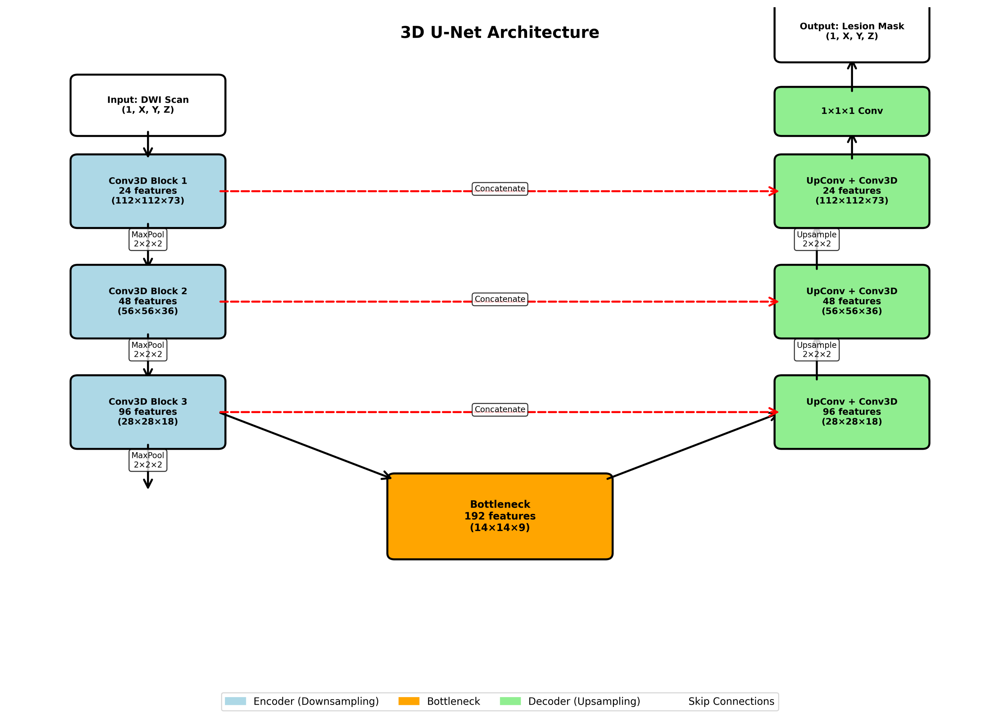
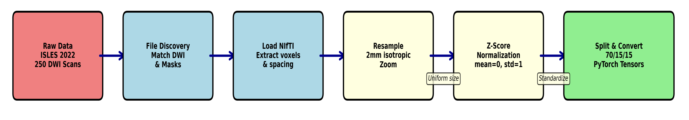
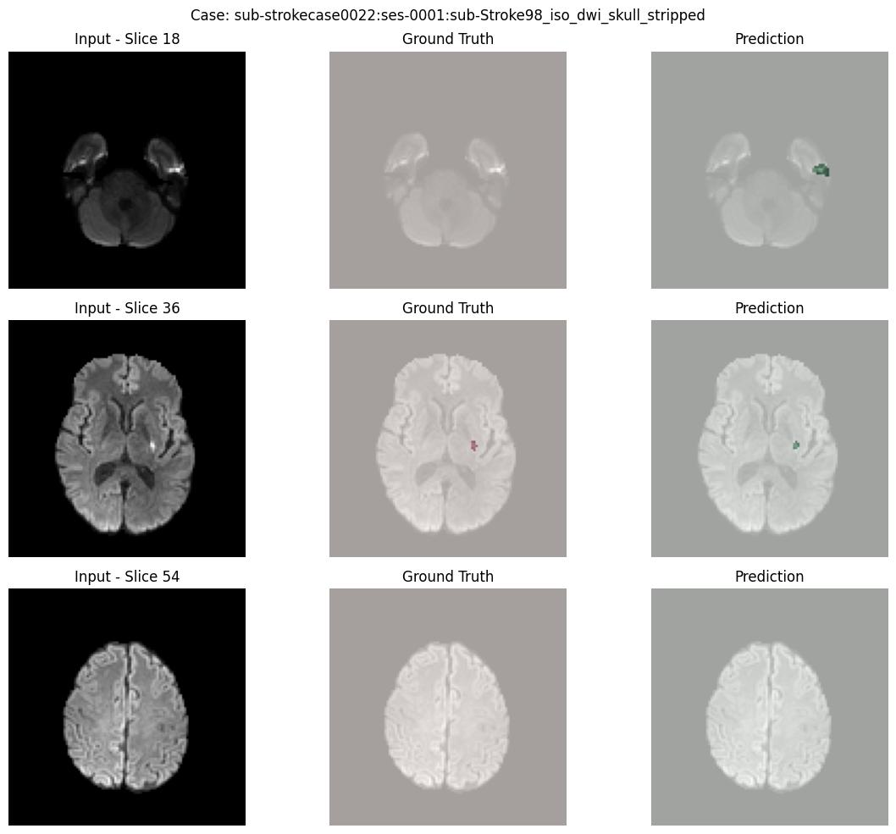
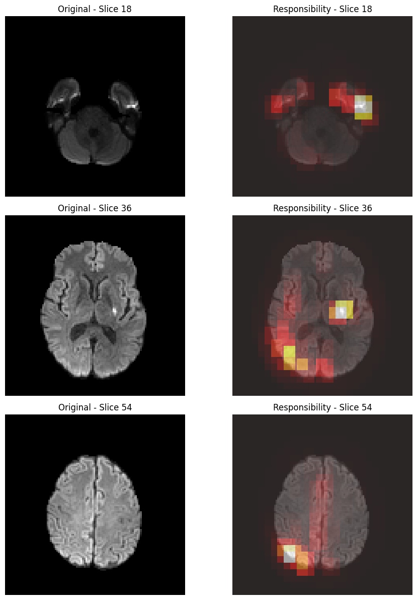
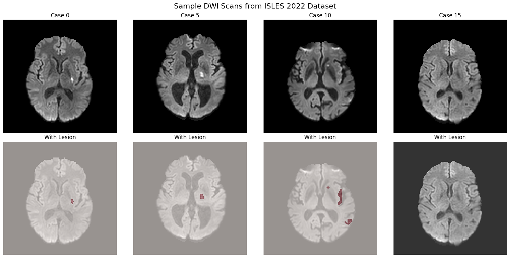
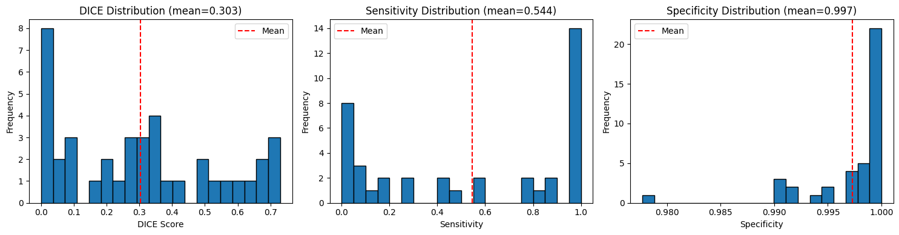

# Deep-Learning-Based-Stroke-Lesion-Segmentation-with-Explainability-Analysis
This project presents an automated pipeline for ischemic stroke lesion segmentation from diffusion-weighted MRI (DWI) scans using 3D deep learning. The system incorporates explainability analysis through perturbation methods to provide interpretable predictions for clinical decision-making.

## 📋 Overview

This project presents an automated pipeline for ischemic stroke lesion segmentation from diffusion-weighted MRI (DWI) scans using 3D deep learning. The system incorporates explainability analysis through perturbation methods to provide interpretable predictions for clinical decision-making.

### Key Features
- ✨ 3D U-Net architecture for volumetric stroke lesion segmentation
- 🔍 Explainability analysis using perturbation-based methods
- 📊 Comprehensive performance evaluation on ISLES 2022 dataset
- 🏥 Clinical relevance with focus on interpretable AI

## 🎯 Research Question

Can 3D deep learning accurately segment stroke lesions while explaining which brain regions drive predictions?

## 💡 Motivation

Ischemic stroke is a major cause of death and disability, with approximately 795,000 strokes occurring annually in the U.S. While MRI is vital for diagnosis, manual interpretation is:
- Time-consuming
- Requires expert radiologists
- Prone to inter-observer variability

Deep learning offers automation potential, but often lacks the transparency needed for clinical adoption. This project addresses the need for both accurate and interpretable stroke lesion segmentation.

## 📊 Dataset

**ISLES 2022 Challenge Dataset**
- **Total Scans:** 250 diffusion-weighted MRI volumes
- **Data Source:** Multi-hospital collection
- **Annotations:** Expert-annotated stroke lesions
- **Lesion Size Range:** 0 - 482,152 mm³

### Dataset Split
| Split | Cases | Percentage |
|-------|-------|------------|
| Training | 174 | 70% |
| Validation | 36 | 15% |
| Testing | 40 | 15% |

### Sample DWI Scans

*Figure 1: Representative diffusion-weighted imaging scans showing various stroke lesion presentations across different patients.*

## 🏗️ Methodology

### Data Preprocessing Pipeline


*Figure 2: Complete data preprocessing workflow from raw data to model-ready tensors.*

The preprocessing pipeline includes:
1. **Raw Data Loading** - Import DWI scans (250 MRI cases)
2. **File Discovery and Labeling** - Organize and label scan files (5 folds)
3. **Load MRI, Match Masks & Scaling** - Standardize and prepare data
4. **Resample Slices to Uniform Depth** - Ensure consistent dimensions
5. **Z-Score Normalization (Mean=0, STD=1)** - Normalize intensity values
6. **Split & Convert to NIFTI & PyTorch Tensors** - Prepare for model input

### Model Architecture: 3D U-Net


*Figure 3: Complete 3D U-Net architecture showing encoder path, bottleneck, and decoder path with skip connections.*

**Encoder Path:**
- Multiple 3D convolutional blocks with downsampling
- Feature extraction at multiple scales
- Batch normalization and ReLU activation

**Bottleneck:**
- Deepest feature representation layer

**Decoder Path:**
- Upsampling with transposed convolutions
- Skip connections from encoder
- Progressive feature map expansion

**Output:**
- Single-channel segmentation mask

### Training Strategy

**Hyperparameters:**
- **Loss Function:** Combined Dice Loss + Weighted Binary Cross-Entropy
- **Optimizer:** Adam (learning rate = 1e-4)
- **Epochs:** 30 with early stopping
- **Training Time:** ~4.5 hours on GPU

**Key Techniques:**
- Class imbalance handling through weighted loss
- Early stopping to prevent overfitting
- Data augmentation for improved generalization

## 🔍 Results

### Segmentation Performance


*Figure 4: Visual comparison of input scans, ground truth annotations, and model predictions across multiple test cases.*

### Performance Metrics


*Figure 6: Dice coefficient distribution, sensitivity, and specificity metrics across the test set.*

- **Dice Score:** 0.30
- **Sensitivity:** Distribution shown in performance analysis
- **Specificity:** High specificity across test cases

### Analysis
While the Dice score is modest (0.30), the results establish a strong foundation demonstrating:
- Model captures clinically relevant features
- Successful handling of class imbalance challenges
- Interpretable predictions aligned with medical expertise
- Room for optimization through advanced techniques

## 🔍 Explainability Analysis


*Figure 5: Perturbation-based explainability maps showing which brain regions the model focuses on for predictions.*

The project implements perturbation-based explainability to understand model decision-making:

**Key Finding:** The model focuses on:
- ✅ Lesion locations and surrounding tissue
- ✅ Clinically relevant brain regions
- ❌ NOT artifacts or distant regions

This validates that the model learns meaningful patterns aligned with clinical knowledge.

### Requirements
```
torch>=1.9.0
torchvision>=0.10.0
numpy>=1.19.0
nibabel>=3.2.0
scikit-image>=0.18.0
matplotlib>=3.3.0
scipy>=1.5.0
tqdm>=4.50.0
```

## 🔮 Future Work

The following improvements are planned to enhance model performance:

1. **Model Ensembling**
   - Combine predictions from multiple models
   - Reduce variance and improve robustness

2. **Multi-Modal Inputs**
   - Incorporate additional MRI sequences (T1, T2, FLAIR)
   - Leverage complementary imaging information

3. **Advanced Architectures**
   - Explore attention mechanisms (U-Net++, Attention U-Net)
   - Test transformer-based architectures (nnU-Net, UNETR)

4. **Post-Processing**
   - Implement connected component analysis
   - Apply morphological operations for refinement
   - Incorporate anatomical constraints

5. **Clinical Validation**
   - Collaborate with radiologists for validation
   - Conduct prospective clinical trials

## 📊 Citation

If you use this work in your research, please cite:
```bibtex
@misc{owusu2024stroke,
  title={Deep Learning-Based Stroke Lesion Segmentation with Explainability Analysis},
  author={Owusu, Dennis and Blemano, David T.A},
  year={2024},
  institution={Michigan Technological University},
  note={Supervised by Dr. Guy Hembroff}
}
```

## 🙏 Acknowledgments

- **ISLES 2022 Challenge** for providing the dataset
- **Dr. Guy Hembroff** for supervision and guidance
- **Michigan Technological University** - College of Computing
- The medical imaging and deep learning research community

## 📄 License

This project is licensed under the MIT License - see the [LICENSE](LICENSE) file for details.

## 📧 Contact

For questions or collaborations, please reach out:

- **Dennis Owusu** - [denniso@mtu.edu]
- **David T.A Blemano** - [dtbleman@mtu.edu]

## 🔗 Related Resources

- [ISLES 2022 Challenge](https://www.isles-challenge.org/)
- [3D U-Net Paper](https://arxiv.org/abs/1606.06650)
- [Medical Image Segmentation Resources](https://github.com/JunMa11/SegLoss)

---

**⭐ If you find this project useful, please consider giving it a star!**
